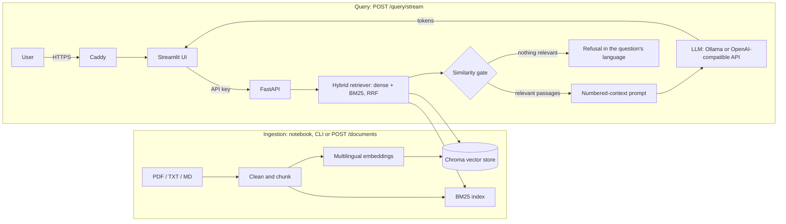

# DocuMind: Production-Ready RAG Document Assistant


Chat with your own documents in **English or Arabic** and get **grounded answers that cite the exact file and page**. DocuMind is a complete Retrieval-Augmented Generation (RAG) application built to be deployed: hybrid retrieval, token streaming, runtime document upload, a bilingual right-to-left UI, and a hardened API with authentication, rate limiting, health probes and metrics. It runs fully local with Ollama, or against any OpenAI-compatible API.

<!-- Add screenshots to docs/screenshots/ and uncomment:

-->

## Highlights

**Answer quality**
- **Hybrid retrieval:** multilingual dense embeddings merged with BM25 keyword scoring through Reciprocal Rank Fusion, so both meaning and exact terms (acronyms, names, numbers) match.
- **Grounded and cited:** the model may only use the numbered passages it is given; answers cite `[n]` and the UI shows file, page and snippet for every source.
- **Hallucination guardrails:** strict prompt, a similarity threshold that refuses when nothing relevant is found (the LLM is not even called), and low temperature.
- **English and Arabic:** ask in either language, even about English documents. Arabic-aware keyword search, answers and refusals in the question's language, right-to-left rendering, Arabic example questions.
- **Reproducible evaluation:** a notebook measuring retrieval (Hit@k, MRR, dense vs hybrid) and end-to-end answers, including out-of-scope questions that must be refused.

**Product**
- **Streaming answers** rendered token by token; **document upload and deletion** from the UI, searchable immediately.
- **Clean end-user UI:** users see only chat, documents and sources. Technical details (backend URL, model, chunk counts, scores, latency, server errors) are hidden; `DEBUG_UI=true` reveals them for demos.
- **Access control:** optional password screen, read-only mode for public demos.

**Production engineering**
- **Pluggable LLM:** local Ollama or any OpenAI-compatible API (OpenAI, Groq, OpenRouter, vLLM...), chosen by configuration.
- **Secure by default in production:** API key between services (never sent to the browser), constant-time key comparison, rate limiting with `Retry-After`, security headers, API docs switched off, non-root containers, only the HTTPS proxy is public.
- **Observability:** `/health` and `/ready` probes, Prometheus `/metrics`, structured JSON logs, request IDs on every response.
- **Self-provisioning:** the container builds its own search index from `data/raw/` on first start (`AUTO_INGEST`), no notebook needed on the server.
- **Automated delivery:** GitHub Actions CI (syntax and Docker Compose checks), Docker image publishing to GHCR, Docker Compose for local and production (automatic HTTPS with Caddy).

## Architecture



## Tech stack

| Layer | Technology |
|---|---|
| Parsing | pypdf |
| Embeddings | sentence-transformers `paraphrase-multilingual-MiniLM-L12-v2` (English, Arabic, 50+ languages) |
| Vector database | ChromaDB (persistent) |
| Lexical search / fusion | pure-Python BM25 (unit tested) + Reciprocal Rank Fusion |
| LLM | Ollama (`llama3.2`, `gemma3:4b`, ...) or any OpenAI-compatible API |
| Backend | FastAPI, Pydantic v2, Uvicorn |
| Frontend | Streamlit with custom theme and RTL support |
| Delivery | Docker, Docker Compose, Caddy (automatic HTTPS), GitHub Actions, GHCR |
| Observability | Prometheus metrics, JSON logs, health and readiness probes |

## Quick start (local)

**Prerequisites:** Python 3.10+ (3.12 recommended), [Ollama](https://ollama.com), Git.

```bash
git clone https://github.com/<your-username>/rag-assistant-app.git
cd rag-assistant-app
python -m venv .venv
.venv\Scripts\activate          # Windows
# source .venv/bin/activate     # macOS / Linux

ollama pull llama3.2            # make sure the Ollama server is running
python run_all.py --install     # install dependencies (first time only)
python run_all.py
```

`run_all.py` checks Ollama, runs the notebook top to bottom and prints **only its outputs (no code)**, saves an output-only report to `notebooks/rag_pipeline_output.html`, runs the backend and frontend tests, starts both services, and opens http://localhost:8501. Press `Ctrl+C` to stop. Options: `--install`, `--skip-notebook`, `--skip-tests`, `--no-serve`.

### Run the parts manually

```bash
# 1. Build the vector store: with the notebook (includes the evaluation) ...
pip install -r requirements-notebook.txt
jupyter notebook notebooks/rag_pipeline.ipynb     # Kernel -> Restart & Run All
# ... or without it, straight from data/raw:
cd backend && python -m app.cli ingest

# 2. Backend (http://localhost:8000/docs)
cd backend
pip install -r requirements.txt
cp .env.example .env            # Windows: copy .env.example .env
uvicorn app.main:app --reload

# 3. Frontend (http://localhost:8501), in a new terminal
cd frontend
pip install -r requirements.txt
cp .env.example .env            # Windows: copy .env.example .env
streamlit run app.py
```

`make help` lists shortcuts for all of this (`make run`, `make ingest`, `make up`, `make prod-up`).

### Docker (local, with Ollama)

```bash
docker compose up --build
docker compose exec ollama ollama pull llama3.2     # first time only
```

Open http://localhost:8501. The index is built from `data/raw/` on first start.

## Deploy it

Production setup with **automatic HTTPS, password screen, API key and rate limiting** on a single server:

```bash
cp .env.example .env            # set DOMAIN, API_KEY, APP_PASSWORD and your LLM settings
docker compose -f docker-compose.prod.yml up -d --build
```

The full walkthrough (server sizing, DNS, hosted LLM vs local Ollama, backups, updates, security checklist, troubleshooting) is in **[docs/DEPLOYMENT.md](docs/DEPLOYMENT.md)**.

## API reference

Interactive docs (development): http://localhost:8000/docs

| Method | Path | Auth | Description |
|---|---|---|---|
| GET | `/health` | none | Liveness: status, number of chunks and documents, model |
| GET | `/ready` | none | Readiness: vector store loaded and LLM reachable (503 otherwise) |
| GET | `/metrics` | none | Prometheus metrics (keep the backend private) |
| POST | `/query` | API key | Grounded answer with sources and citations |
| POST | `/query/stream` | API key | Same, streamed as newline-delimited JSON events |
| GET | `/documents` | API key | List indexed documents with chunk counts |
| POST | `/documents` | API key | Upload and index a PDF, TXT or MD file (multipart) |
| DELETE | `/documents/{name}` | API key | Remove a document from the index |

"API key" means the `X-API-Key` header is required when the backend runs with `API_KEY` set.

```bash
curl -X POST http://localhost:8000/query \
  -H "Content-Type: application/json" -H "X-API-Key: $API_KEY" \
  -d '{"question": "What is the F1 score?", "top_k": 4}'
```

```json
{
  "answer": "The F1 score is the harmonic mean of precision and recall [1].",
  "sources": ["03_model_evaluation.pdf (page 1)"],
  "citations": [{"ref": 1, "source": "03_model_evaluation.pdf", "page": 1, "score": 0.81, "snippet": "..."}],
  "latency_ms": 2140,
  "model": "llama3.2"
}
```

`/query/stream` emits one JSON object per line: `meta`, then `token` events, then `done` (with `sources`, `citations`, `latency_ms`) or `error`.

```bash
curl -N -X POST http://localhost:8000/query/stream -H "Content-Type: application/json" \
  -H "X-API-Key: $API_KEY" -d '{"question": "ما هو تسرب البيانات؟"}'
curl -X POST http://localhost:8000/documents -H "X-API-Key: $API_KEY" -F "file=@my_notes.pdf"
```

Errors: `401` bad or missing API key, `422` invalid input, `429` rate limited (with `Retry-After`), `503` LLM unavailable, `415` unsupported file type, `413` file too large, `404` unknown document. Every response has `X-Request-ID` and `X-Process-Time-ms` headers.

## Configuration

**Backend** (`backend/.env`, see `backend/.env.example`)

| Variable | Default | Description |
|---|---|---|
| `LLM_PROVIDER` | `ollama` | `ollama` or `openai` (any OpenAI-compatible API) |
| `OLLAMA_HOST` / `OLLAMA_MODEL` | `http://localhost:11434` / `llama3.2` | Local model settings (`gemma3:4b` is better for Arabic) |
| `LLM_BASE_URL` / `LLM_API_KEY` / `LLM_MODEL` | OpenAI URL / none / none | Hosted API settings for `LLM_PROVIDER=openai` |
| `API_KEY` | none | When set, required as `X-API-Key` on all query and document endpoints |
| `RATE_LIMIT_PER_MINUTE` | `0` (off) | Questions per minute per client address |
| `TOP_K` / `MIN_SIMILARITY` | `4` / `0.25` | Passages passed to the LLM / refusal threshold |
| `MAX_UPLOAD_MB` | `20` | Maximum upload size |
| `AUTO_INGEST` | `false` | Build the index from `data/raw` when none exists |
| `EMBEDDING_MODEL`, `CHUNK_SIZE`, `CHUNK_OVERLAP` | multilingual MiniLM, `800`, `100` | Used by `python -m app.cli ingest` |
| `ENABLE_DOCS` | `true` | `false` hides `/docs` and `/openapi.json` |
| `LOG_LEVEL` / `LOG_FORMAT` | `INFO` / `text` | `json` for structured logs |
| `CORS_ORIGINS` | `http://localhost:8501` | Comma-separated allowed origins |

**Frontend** (`frontend/.env`)

| Variable | Default | Description |
|---|---|---|
| `API_BASE_URL` | none (required) | Backend URL, e.g. `http://localhost:8000` |
| `API_KEY` | none | Sent to the backend as `X-API-Key` (server side only) |
| `APP_PASSWORD` | none | Shows a sign-in screen protecting the whole app |
| `READ_ONLY_DOCUMENTS` | off | Hides document upload and delete |
| `DEBUG_UI` | off | Shows backend URL, model, counts, similarity, latency |
| `EXAMPLE_QUESTIONS` / `EXAMPLE_QUESTIONS_AR` | sample questions | Example chips, separated by `\|` |

## Arabic support

DocuMind answers Arabic questions in Arabic, including when the documents are in English.

- **Multilingual retrieval:** one embedding space for Arabic and English, so an Arabic question finds the right English passage.
- **Arabic-aware keyword search:** BM25 tokenizer removes diacritics and tatweel, unifies letter variants (أ إ آ, ى, ة), converts Arabic-Indic digits, drops Arabic stop words and strips the definite article (ال), so `التصنيف` matches `تصنيف`.
- **Language-aware answers:** the prompt asks for an Arabic answer to an Arabic question, and refusals are Arabic too.
- **Right-to-left UI:** messages, streamed answers and snippets are right-aligned; the empty screen offers Arabic example questions.

Answer quality in Arabic depends on the LLM: `llama3.2` is weakest, so use `gemma3:4b` with Ollama or a stronger hosted model. Changing the embedding model requires rebuilding the index. `MIN_SIMILARITY` depends on the embedding model: check the out-of-scope scores in the notebook's retrieval table and tune it.

## Project structure

```
rag-assistant-app/
├── backend/
│   ├── app/
│   │   ├── main.py                 # app, middleware (request id, metrics, headers), lifespan
│   │   ├── cli.py                  # python -m app.cli ingest
│   │   ├── api/routes/             # query.py (query, stream, health, ready, metrics), documents.py
│   │   ├── core/                   # config, security (API key, rate limit), ratelimit, metrics
│   │   ├── schemas/                # request / response models
│   │   ├── services/               # retrieval, generation, llm (Ollama / OpenAI-compatible), bm25,
│   │   │                           # language (Arabic), prompts, ingestion, indexer, text_processing
│   │   └── utils/logging_config.py # text and JSON logging
│   ├── data/vector_store/          # persisted index (built by the notebook, the CLI or AUTO_INGEST)
│   ├── requirements.txt  .env.example  Dockerfile
├── frontend/                       # app.py, api_client.py, .streamlit/, Dockerfile
├── data/raw/                       # sample documents (replace with your own)
├── notebooks/rag_pipeline.ipynb    # load, chunk, embed, retrieve, evaluate, export
├── deploy/Caddyfile                # HTTPS reverse proxy
├── docs/DEPLOYMENT.md  docs/screenshots/
├── docker-compose.yml              # local stack
├── docker-compose.prod.yml         # production stack with HTTPS
├── .github/workflows/              # ci.yml (tests), docker.yml (publish images)
├── run_all.py  Makefile  .env.example  requirements-all.txt  requirements-notebook.txt
└── LICENSE
```

## Domain and data

**Domain:** machine-learning study notes. **Corpus:** 6 text-based PDFs (9 pages) in `data/raw/`. Replace them with your own documents and rebuild (`python -m app.cli ingest`, or re-run the notebook), or upload files from the UI.

## How grounding works

1. The question is embedded (Arabic or English); the top dense candidates are re-ranked with BM25 using Reciprocal Rank Fusion.
2. Passages below the similarity threshold are dropped. If none remain, the assistant refuses without calling the LLM.
3. Otherwise the passages are sent as numbered context with a strict prompt: answer only from the context, in the question's language, cite `[n]`, or reply with a fixed refusal sentence.
4. Cited numbers are mapped back to file, page, similarity and snippet, and returned as `citations`.

## Design decisions and trade-offs

- **Pluggable LLM:** a small client interface (`chat`, `stream`, `ping`) keeps the RAG logic independent of the provider, so the same code runs on a laptop with Ollama or on a small cloud server with a hosted API.
- **Streamlit calls the API, not the browser:** the API key never reaches the client, and the backend stays on a private network.
- **BM25 without a search engine:** a small in-memory index is rebuilt when documents change. It suits a corpus of thousands of chunks; a much larger corpus would call for a dedicated search backend.
- **Fusion over dense candidates:** BM25 re-ranks the top dense candidates, so every result keeps its cosine similarity for the refusal gate.
- **Per-page chunking:** chunks never cross pages, so every citation points to an exact page.
- **Shared password, not user accounts:** a deliberate simplicity trade-off; the API key and password give sensible protection for a demo or a small team.
- **Single worker:** the embedding model and index are loaded once per process; scale up with a bigger machine or run several replicas behind a load balancer.

## Evaluation results

Section 2.6 of the notebook evaluates 17 questions (English and Arabic, in scope and out of scope); section 2.4b compares dense vs hybrid retrieval. Results are saved to `notebooks/evaluation_results.csv`.

_Paste the results table, the retrieval comparison and the failure-case summary from the notebook here._

## Screenshots

_Add screenshots of the running app to `docs/screenshots/` and link them here._

## Limitations and roadmap

- Arabic and English are supported; other languages are covered by the embedding model, but prompts, refusals and UI are tuned for these two.
- Scanned PDFs need OCR before upload.
- Follow-up questions are answered independently (no conversation memory yet).
- Login is a shared password; per-user accounts would need an identity provider.
- Ideas: cross-encoder re-ranking, conversation-aware query rewriting, a feedback (thumbs up/down) loop, OCR ingestion.

## License

MIT, see [LICENSE](LICENSE).
