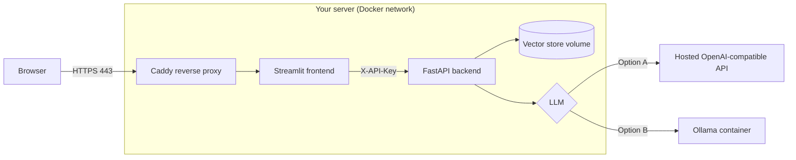

# Deployment guide

This guide puts DocuMind on the internet with **automatic HTTPS**, a password screen, an API key between the services, and rate limiting. It uses Docker Compose on a single Linux server, which is the simplest setup that is still production-grade.

## Architecture



- Only Caddy publishes ports (80 and 443). The backend and Ollama are not reachable from the internet.
- The API key stays between the frontend container and the backend; browsers never see it.
- The vector store lives in a Docker volume, so uploads survive restarts and updates.

## 1. Choose how the model runs

| | Option A: hosted API | Option B: local Ollama |
|---|---|---|
| Server size | 2 vCPU, 4 GB RAM | 4 vCPU, 8 GB RAM or more |
| Cost | Pay per use to the provider | Server only |
| Privacy | Questions and passages go to the provider | Nothing leaves your server |
| Arabic quality | Depends on the model you pick | Use `gemma3:4b` for better Arabic |
| Setting | `LLM_PROVIDER=openai` | `LLM_PROVIDER=ollama` |

Option A works with any OpenAI-compatible API: set `LLM_BASE_URL`, `LLM_API_KEY` and `LLM_MODEL` (a chat model from the provider's catalogue). Common base URLs are `https://api.openai.com/v1`, `https://api.groq.com/openai/v1` and `https://openrouter.ai/api/v1`. A hosted model is the practical choice for small, cheap servers because a CPU-only server answers slowly with a local model.

## 2. Prepare the server

1. Create an Ubuntu 22.04 or 24.04 server at any provider (Hetzner, DigitalOcean, AWS Lightsail, Azure, ...).
2. Point a DNS **A record** for your domain (for example `documind.example.com`) to the server's IP address.
3. Install Docker: follow [docs.docker.com/engine/install/ubuntu](https://docs.docker.com/engine/install/ubuntu/) (Docker Engine plus the Compose plugin).
4. Open the firewall for web traffic only:
   ```bash
   sudo ufw allow OpenSSH && sudo ufw allow 80 && sudo ufw allow 443 && sudo ufw enable
   ```

## 3. Configure and start

```bash
git clone https://github.com/<your-username>/rag-assistant-app.git
cd rag-assistant-app
cp .env.example .env
nano .env
```

Fill in at least:

```
DOMAIN=documind.example.com
API_KEY=<output of: openssl rand -hex 32>
APP_PASSWORD=<a strong password>          # recommended for anything public
LLM_PROVIDER=openai
LLM_API_KEY=<your provider key>
LLM_MODEL=<chat model name>
```

Start it:

```bash
docker compose -f docker-compose.prod.yml up -d --build
# Option B (local model) instead:
#   set LLM_PROVIDER=ollama in .env, then
#   docker compose -f docker-compose.prod.yml --profile ollama up -d --build
#   docker compose -f docker-compose.prod.yml exec ollama ollama pull llama3.2
```

On the first start the backend builds the search index from `data/raw/` (this downloads nothing extra: the embedding model is baked into the image). Open `https://<your-domain>`. The first request may take a moment while models warm up.

## 4. Use your own documents

- **Before deploying:** put your PDF, TXT or MD files in `data/raw/` and rebuild. Delete the sample PDFs if you do not want them.
- **After deploying:** sign in and upload files from the sidebar.
- **Public demo:** set `READ_ONLY_DOCUMENTS=true` so visitors can browse but not change the documents.
- **Rebuild the index from `data/raw/`:**
  ```bash
  docker compose -f docker-compose.prod.yml exec backend python -m app.cli ingest
  docker compose -f docker-compose.prod.yml restart backend
  ```
  This replaces the index, including documents uploaded through the UI.

## 5. Operate it

| Task | Command |
|---|---|
| Follow logs (JSON lines) | `docker compose -f docker-compose.prod.yml logs -f backend frontend` |
| Check status | `docker compose -f docker-compose.prod.yml ps` |
| Update to a new version | `git pull && docker compose -f docker-compose.prod.yml up -d --build` |
| Stop | `docker compose -f docker-compose.prod.yml down` |
| Reset the index (delete uploads) | `docker compose -f docker-compose.prod.yml down -v` |

**Monitoring.** The backend exposes `/health` (liveness), `/ready` (vector store loaded and LLM reachable) and `/metrics` (Prometheus format: request counts, latency, questions asked, refusals). They are only reachable inside the Docker network; from the server run
`docker compose -f docker-compose.prod.yml exec backend python -c "import urllib.request as u; print(u.urlopen('http://localhost:8000/ready').read().decode())"`.
Point Prometheus, Grafana Agent or an uptime checker at them if you run one.

**Backups.** Back up the `.env` file and the vector store volume:

```bash
docker run --rm -v rag-assistant-app_vector_store:/data -v "$PWD":/backup alpine \
  tar czf /backup/vector_store_$(date +%F).tgz -C /data .
```

(The volume name is `<folder name>_vector_store`; check with `docker volume ls`.)

## 6. Prebuilt images (optional)

Every push to `main` publishes the images to GitHub Container Registry through `.github/workflows/docker.yml`. To deploy them without building on the server, set in `.env`:

```
BACKEND_IMAGE=ghcr.io/<your-username>/rag-assistant-app/backend:main
FRONTEND_IMAGE=ghcr.io/<your-username>/rag-assistant-app/frontend:main
```

then run `docker compose -f docker-compose.prod.yml pull && docker compose -f docker-compose.prod.yml up -d`. If the packages are private, run `docker login ghcr.io` on the server first.

## 7. Security checklist

- [ ] `API_KEY` is a long random value, and `.env` is not committed (it is in `.gitignore`).
- [ ] `APP_PASSWORD` is set if the site is public. It is one shared password: rotate it when people leave, and add a real identity provider if you need per-user accounts.
- [ ] Only ports 80 and 443 are open (`sudo ufw status`).
- [ ] `ENABLE_DOCS=false` (the production compose file does this) so the API documentation is not public.
- [ ] `RATE_LIMIT_PER_MINUTE` is set. It is applied per client address, and behind the web app every visitor shares the frontend's address, so treat it as a **global cost cap** on questions.
- [ ] Documents you index are ones you are allowed to share with every user of the app.
- [ ] With a hosted LLM, remember that questions and retrieved passages are sent to that provider.
- [ ] Keep the server and images updated (`apt upgrade`, rebuild regularly).

## 8. Other platforms

The images run anywhere Docker runs. They need **at least 2 GB of RAM** (PyTorch and the embedding model), which rules out the smallest free tiers of some platforms. On a managed platform (Render, Railway, Fly.io, Azure Container Apps, Google Cloud Run, AWS ECS) deploy the two images, give the backend a persistent volume at `/app/data/vector_store`, set the same environment variables as in `.env.example`, and put the frontend behind the platform's HTTPS. Keep the backend private (no public URL) and set `API_BASE_URL` on the frontend to its internal address.

## Troubleshooting

| Symptom | Likely cause and fix |
|---|---|
| Browser shows a certificate warning | DNS has not propagated or ports 80/443 are blocked. Check `docker compose ... logs caddy`. |
| "The assistant is temporarily unavailable" | The LLM is not reachable. Check `LLM_API_KEY` / `LLM_BASE_URL` / `LLM_MODEL`, or that `ollama pull` finished. Look at the backend logs for the real error. |
| Backend container keeps restarting | Read `docker compose ... logs backend`. Usually not enough RAM (use a bigger server) or a wrong setting. |
| `API_KEY` error when starting compose | `API_KEY` is empty in `.env`. |
| Uploads disappear after `down -v` | `-v` deletes the volume. Use plain `down` to keep it. |
| Answers in Arabic are poor | Use a stronger model (`gemma3:4b` with Ollama, or a larger hosted model). |
